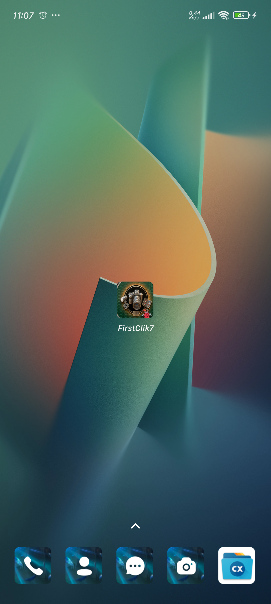
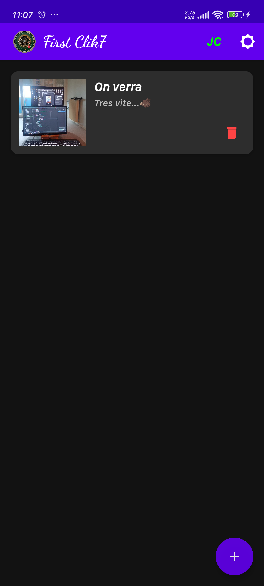
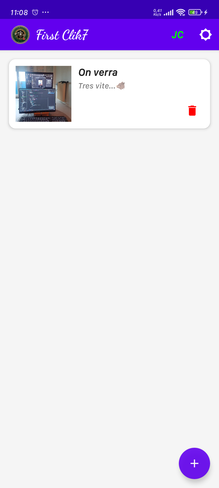

# 📱 First Clik7 🥚
Version Kotlin Android CameraX

First Clik7 est une application Android native conçue pour capturer des moments et les explorer avec une précision extrême. Grâce à une intégration poussée de la caméra et un système de zoom intelligent, elle offre une gestion fluide et professionnelle de vos photographies.

---

## 🆘 Aide & Reconstruction (Nouveau !)
Pour vous aider à recréer ce projet de A à Z ou pour comprendre chaque ligne de code en détail, consultez mon guide interactif complet :

👉 **[Consulter la Documentation Master (HTML)](Documentation_FirstClik7.html)**

Ce guide inclut :
- Une checklist de progression sauvegardée.
- Tous les codes sources complets prêts à copier-coller.
- Un mode Sombre/Clair pour le confort de lecture.
- Le lien vers le pack de ressources (PicsSoundPack.zip.).

---

## 📖 Sommaire
1. [🚀 Fonctionnalités](#-fonctionnalités)
2. [🛠 Technologies & Librairies](#-technologies--librairies)
3. [📂 Structure du Projet](#-structure-du-projet)
4. [🔍 Focus Technique : ZoomDialog](#-focus-technique--zoomdialog)
5. [⚙️ Installation & Configuration](#️-installation--configuration)
6. [📋 Pré-requis](#-pré-requis)

---

## 🚀 Fonctionnalités
L'application propose un cycle complet de gestion d'image :

- 📸 **Capture Haute Précision** : Utilisation de CameraX pour une prise de vue stable et optimisée selon le matériel de l'appareil.
- 🖼️ **Galerie Intelligente** : Affichage dynamique via un `RecyclerView` utilisant le moteur de rendu Flexbox, permettant une disposition fluide des miniatures.
- 🔍 **Système "Deep Zoom"** : Visualisation en plein écran avec support du pincement (pinch-to-zoom) pour inspecter les détails de chaque cliché.
- 6️⃣ **Gestion de Base de Données** : Persistance des chemins de photos via Room pour garantir que vos souvenirs sont conservés après chaque redémarrage.

## 🛠 Technologies & Librairies
Le projet s'appuie sur une stack technique moderne et robuste :

- **Langage** : Kotlin (Coroutines pour la fluidité des tâches de fond).
- **Architecture UI** :
  - `ViewBinding` : Pour des références de vues sécurisées.
  - `FlexboxLayout` : Pour une grille de photos flexible.
- **Manipulation d'images** :
  - [Glide](https://github.com/bumptech/glide) : Pour le chargement, le redimensionnement et la mise en cache ultra-rapide.
  - [PhotoView](https://github.com/Baseflow/PhotoView) : Pour implémenter le zoom interactif et fluide sur les images.
- **Android Jetpack** :
  - `CameraX` : Gestion simplifiée de l'appareil photo.
  - `Room (v2.6.1)` : Stockage local des données.

## 📂 Structure du Projet
L'organisation suit une logique modulaire claire :

- `MainActivity.kt` : Point d'entrée, gestion des permissions et interface principale.
- `ZoomDialog.kt` : Composant dédié à l'affichage haute résolution.
- `PhotoAdapter.kt` : Gestionnaire de l'affichage des miniatures dans la galerie.
- `R.layout.dialog_zoom` : Layout optimisé pour la visualisation plein écran.

## 🔍 Focus Technique : ZoomDialog
La classe `ZoomDialog.kt` est le cœur de l'expérience utilisateur pour la visualisation. Voici ses actions clés :

### 🛠 Configuration de l'affichage
Elle utilise un style spécifique pour garantir une immersion totale :

```kotlin
setStyle(STYLE_NO_TITLE, android.R.style.Theme_Black_NoTitleBar_Fullscreen)
```

### 🧠 Logique de Chargement Intelligente
La fonction détecte dynamiquement la source de l'image pour un chargement sans erreur :

- **URI Content (`content://`)** : Pour les fichiers gérés par le système.
- **Ressources Android (`android.resource://`)** : Pour les images internes.
- **Chemin Direct** : Pour les fichiers stockés sur l'espace disque.

### 🖱️ Interaction
- `PhotoView` : Permet le zoom multipoint nativement.
- `CanceledOnTouchOutside` : Permet de fermer le zoom simplement en cliquant à côté de l'image.

## ⚙️ Installation & Configuration
1. **Clonage** :
   ```bash
   git clone https://github.com/Septieme7/firstclik7.git
   ```

2. **Ouverture** : Importer le projet dans Android Studio (Version Hedgehog ou supérieure).

3. **Build** : Synchroniser Gradle pour télécharger les dépendances (Glide, PhotoView, Room).

4. **Permissions** : Au premier lancement, l'application demandera l'accès à la `CAMERA` et au stockage.

## 📋 Pré-requis
- **Version Android** : API 24 (Android 7.0 Nougat) ou plus récent.
- **Matériel** : Un appareil avec caméra physique est recommandé pour tester la capture.

---

Développé avec ❤️&☕ dans le cadre du projet First Clik7. et merci JC... ton 🐤... egg for U 🥚🥚🥚...
01011100011... 888811188811...🪳


	

---
